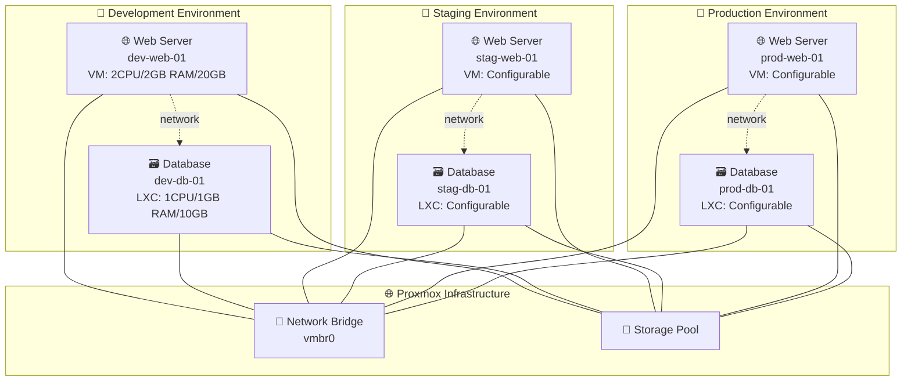

# Localhouse Blue Theme

プロフェッショナルなプレゼンテーション用テーマ

**Slidev版サンプル**

---
layout: section
---

# セクション タイトル

メインセクションの紹介

---

## コンテンツ サンプル

### 見出し3のサンプル

通常のテキストです。**太字テキスト**や*斜体テキスト*も表示できます。

- リスト項目 1
- リスト項目 2
  - サブ項目 A
  - サブ項目 B
- リスト項目 3

---

## コード表示サンプル

インラインコード: `console.log('Hello World')`

### 標準サイズのコード

```javascript
// JavaScriptコードサンプル
function greetUser(name) {
  const message = `Hello, ${name}!`;
  console.log(message);
  return message;
}

greetUser('Slidev User');
```

---

## テーブル表示サンプル

| 項目 | 説明 | 値 |
|------|------|-----|
| テーマ | Localhouse Blue | プロフェッショナル |
| カラー | 企業ブルー | #003366 |
| フォント | LINE Seed JP | 日本語対応 |

---

## 引用文のサンプル

> これは引用文のサンプルです。
> 
> 複数行の引用も可能です。

リンクのサンプル: [Slidev公式サイト](https://sli.dev)

---

## Mermaidダイアグラム サンプル




---
layout: center
---

# 中央レイアウト

このスライドは中央配置レイアウトを使用しています。

---
layout: two-cols
---

# 2カラム レイアウト

左側のコンテンツ：

- ポイント1
- ポイント2
- ポイント3

::right::

右側のコンテンツ：

- 詳細情報A
- 詳細情報B
- 詳細情報C

---
layout: quote
---

# "素晴らしいプレゼンテーションは、優れたテーマから始まる"

Localhouse Blue Theme

---
layout: end
---

# ありがとうございました

Localhouse Blue Theme for Slidev

**お疲れさまでした！**
